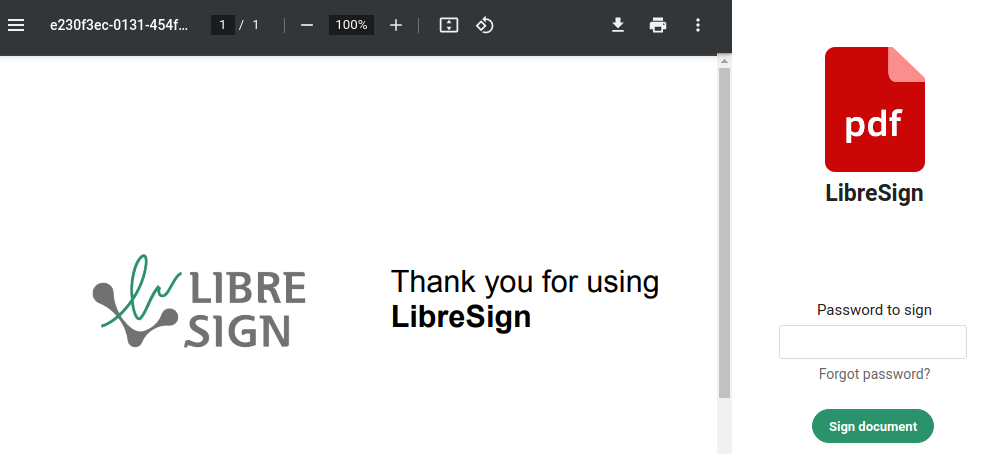

<!--
 - SPDX-FileCopyrightText: 2020-2024 LibreCode coop and contributors
 - SPDX-License-Identifier: AGPL-3.0-or-later
-->

Nextcloud app to sign PDF documents.

## Contributing

There are many ways to contribute, including writing code, filing issues on GitHub, helping people Overflow, helping to triage, reproduce, or fix bugs that people have filed, adding to our documentation.
To get more details go to our [contributing guide](CONTRIBUTING.md).

## Integrations

* [GLPI](https://github.com/LibreSign/libresign-glpi): Plugin to sign GLPI tickets
* [Approval](https://github.com/nextcloud/approval): Approve/reject files based on workflows defined by admins

## API Documentation

[API Documentation](https://libresign.github.io/)
