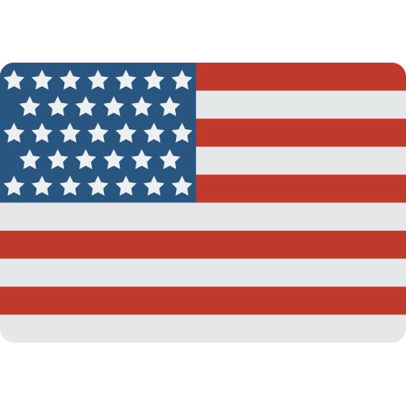

[](../README.md) [](./l10n/README_pt-BR.md)


# Libresign

Nextcloud app to sign PDF documents 

## Setup

### Java and JSignPDF

Add the follow to Nextcloud PHP container Dockerfile

```Dockerfile
# Install Java and JsignPDF
RUN mkdir -p /usr/share/man/man1
RUN apt-get install -y default-jre
RUN curl -OL https://sourceforge.net/projects/jsignpdf/files/stable/JSignPdf%201.6.4/JSignPdf-1.6.4.zip \
    && unzip JSignPdf-1.6.4.zip -d /opt \
    && rm JSignPdf-1.6.4.zip
```

### With CFSS server

Up a cfssl server using this code:

https://github.com/cloudflare/cfssl

The URL of server you will use in [Admin settings](#admin-settings)

### With docker-compose
* put the file `/cfssl/entrypoint.sh` in `cfssl` folder
* Add the volume `./cfssl:/cfssl` in Nextcloud service
* Create a new server using the following code:
```yml
  cfssl:
    image: cfssl/cfssl
    volumes:
      - ./cfssl:/cfssl
    working_dir: /cfssl
    entrypoint: /bin/bash
    command:
      - /cfssl/entrypoint.sh
```

### Admin settings

Go to `Settings > Security` and fill the necessary values for root certificate:

```
CN: CommonName
OU: OrganizationalUnit
O: Organization
C: CountryName
API: http://cfssl:8888/api/v1/cfssl/
Config path: /cfssl/
```
