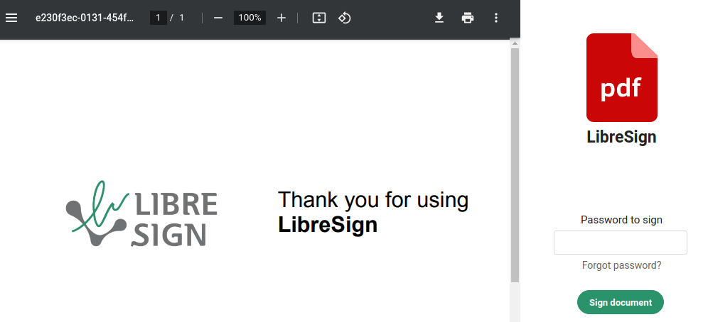

<!--
 - SPDX-FileCopyrightText: 2020-2026 LibreCode coop and contributors
 - SPDX-License-Identifier: AGPL-3.0-or-later
-->

# LibreSign

Control how your documents get signed

LibreSign helps you control how document signing works in your organization.
Organizations use it with Nextcloud to run signing workflows that match internal rules, legal requirements, and daily processes.
It gives teams clear visibility into who signed, when they signed, and how each request moved through the process.

## Key features

- Define signing order, roles, and rules per document flow
- Include internal and external signers in the same request
- Keep a traceable record of requests, actions, and validations
- Work directly with Nextcloud files, users, and sharing context
- Configure certificates and identity options for your signing process
- Integrate signing with other systems through APIs

## Why LibreSign

LibreSign is for teams where signing is part of a controlled business process.

- Define clear signing rules by role, stage, or document type
- Keep traceability for audits, legal checks, and internal reviews
- Align signing with existing approval and governance processes
- Adapt workflows to how your organization works instead of following fixed external models

## Contributing

Contributions are welcome from developers, implementers, and teams that use LibreSign in production.

- Report bugs or suggest improvements: [Open an issue](https://github.com/LibreSign/libresign/issues)
- Start with simple tasks: [Good first issues](https://github.com/LibreSign/libresign/issues?q=is%3Aissue+is%3Aopen+label%3A%22good+first+issue%22)
- Help with translations: [Transifex](https://app.transifex.com/nextcloud/nextcloud/libresign)

## Contributors

Thanks to all the people who contribute to LibreSign:

## Screenshots

  

## Documentation

- Official documentation: https://docs.libresign.coop/
- Developer manual: https://docs.libresign.coop/developer_manual/
- Documentation repository: https://github.com/LibreSign/documentation

## Sponsors

If your organization depends on LibreSign, please sponsor the project.

Sponsorship directly supports ongoing maintenance, reliable releases, better documentation, and long-term continuity for teams that rely on LibreSign in real workflows.

Support LibreSign: https://github.com/sponsors/LibreSign
