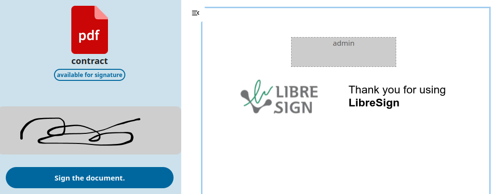

<!--
 - SPDX-FileCopyrightText: 2020-2024 LibreCode coop and contributors
 - SPDX-License-Identifier: AGPL-3.0-or-later
-->

# LibreSign for Nextcloud

LibreSign is a digital signature application for Nextcloud that enables secure document signing workflows directly within your self-hosted environment.

It supports internal and external signers, certificate-based signatures, and full document lifecycle management.

## Why LibreSign?

- Fully self-hosted digital signature solution
- Integrated with Nextcloud ecosystem
- Supports internal and external signers
- Open source (AGPL-3.0)
- Extensible API

---
## Quick Links

- 📖 [Full Documentation](https://github.com/LibreSign/documentation)
- 🐛 [Report a bug](https://github.com/LibreSign/libresign/issues/new?template=bug_report.yml)
- 💡 [Request a feature](https://github.com/LibreSign/libresign/issues/new?template=feature_request.yml)
- 🌍 [Translations (Transifex)](https://app.transifex.com/nextcloud/nextcloud/libresign)
---

## Who is this for?

- 🛠 Nextcloud administrators who want to deploy a digital signature solution
- 👤 End users who need to sign or request signatures on documents
- 🏢 Organizations looking for a self-hosted signature workflow

---

## Documentation

Complete guides are available for:

- 🔧 Administrators (installation, configuration, certificates)
- 👥 Users (how to request and sign documents)
- 🧪 Developers (architecture and API)

👉 https://github.com/LibreSign/documentation

---

## Installation

LibreSign can be installed from the Nextcloud App Store or manually.

After enabling the app, administrators must install required standalone dependencies and configure certificates.

### 1️⃣ Install dependencies
Run the following command as your web server user:
`occ libresign:install --java --pdftk --jsignpdf`

This will install:
- Java (standalone JRE)
- PDFtk
- JSignPdf
  
All binaries are installed inside the Nextcloud `data/appdata_*/libresign` directory.
No system-wide installation is required.

### 2️⃣ Verify installation
`sudo -u www-data php /path/to/nextcloud/occ libresign:configure:check`

This command verifies:
- Java availability
- PDFtk setup
- JSignPdf setup
- OpenSSL configuration
- Certificate environment

### 3️⃣ Configure root certificate
You can generate a certificate using OpenSSL or CFSSL.

Example using OpenSSL:
`sudo -u www-data php /path/to/nextcloud/occ libresign:configure:openssl --cn="Your Organization - Digital Signature" --o="Your Organization" --c="FR" --st="Region" --l="City"`

Certificates are generated and stored inside the Nextcloud data directory: `nextcloud_data_dir/appdata_*/libresign`

No additional server-level configuration is required.

📖 For full configuration details, advanced setups, and troubleshooting:
https://github.com/LibreSign/documentation

---

## Architecture

LibreSign installs all required binaries in standalone mode inside the Nextcloud data directory.
This design improves portability and avoids dependency conflicts with the host system.

It does not require:

- System-wide Java installation
- System-wide PDFtk installation
- External certificate authority configuration

All cryptographic operations are self-contained within Nextcloud.

---

## How it works

1. A user uploads a document.
2. The user defines signers (internal or external).
3. Signers receive a notification or link.
4. The document is signed and stored in Nextcloud.
5. Signature validation and certificate verification are performed automatically.
---

### Additional dependencies:
- poppler-utils
- System locale configured with UTF-8 charset

---

## Integrations

* [GLPI](https://github.com/LibreSign/libresign-glpi): Plugin to sign GLPI tickets
* [Approval](https://github.com/nextcloud/approval): Approve/reject files based on workflows defined by admins

---

## API Documentation

Developer manual: https://docs.libresign.coop/developer_manual/index.html

---

## Security

LibreSign uses certificate-based digital signatures and follows best practices for secure document validation. 

For responsible disclosure and security policy, please see [SECURITY.md](SECURITY.md).

---

## Contributing

We welcome contributions!

- Bug reports and feature requests: Issues tab
- Code contributions: Pull Requests
- Translations: Transifex https://app.transifex.com/nextcloud/nextcloud/libresign
- Documentation improvements: https://github.com/LibreSign/documentation
- To get more details go to our [contributing guide](CONTRIBUTING.md).

---

## License

LibreSign (this repository) is licensed under the **GNU Affero General Public License v3.0 or later (AGPL-3.0-or-later)**.
- 📂 All licenses: [LICENSES/](LICENSES/)
- 📘 Also in Documentation repository: https://github.com/LibreSign/documentation/blob/main/LICENSE

---

## Screenshots

  

---

## Contributors ✨

Thanks go to these wonderful people:

## Star History

