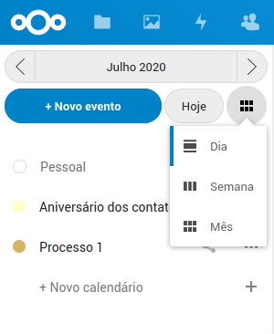

# Gestão de agenda

Para gerir as datas limites dos processos e outros eventos, é possivel utlizar o aplicativo Calendário. Para acessar, clique no icone no menu superior da tela.

Todo usuário tem um calendário pessoal, onde é possivel agendar eventos, também é possivel criar ou compartilhar calendários, para que outros usuários tenham acesso aos mesmos eventos.

Também é possivel selecionar quais calendários devem ter os eventos exibidos na tela, clicando no calendário no menu esquerdo.

É possivel alterar a visualização dos eventos por dia, semana ou mês.

