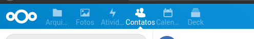
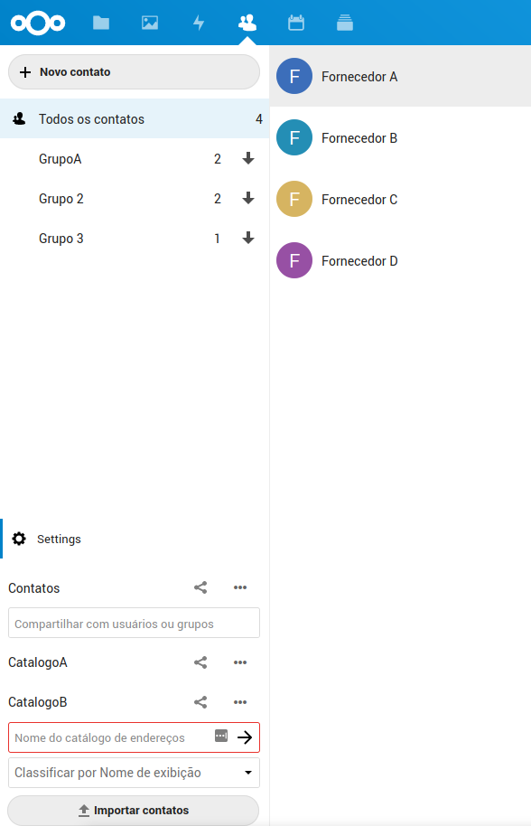

# Gestão de contatos

Através do apicativo de contatos, é possivel armazenar as informações dos Fornecedores.
Para acessar os contatos, selecione o icone na barra superior.

Todo contato pode pertencer a um ou vários grupos, de acordo com o campo `Grupos` no cadastro do contato. Caso o grupo informado não exista, um novo será criado.

Obrigatóriamente, todo contato pertence a um catálogo. Todos usuários tem um catálogo por padrão, e novos podem ser criados, ou compartilhados.

Quando o usuário passa a ter mais de um catálogo, seja criando um novo ou por compartilhamento, é possivel alterar o catálogo a que o contato pertence, alterando o campo `Catálogo de endereços` no cadastro do contato.

Para compartilhar um catálogo com outros usuários, acessar opção `Settings` no canto inferior esquerdo, e escolher o catálogo a ser compartilhado.

Caso o catálogo compartilhado tenha seus contatos organizados em grupos, os usuários com quem o compartilhamento foi feito também poderam visualizar estes grupos.
