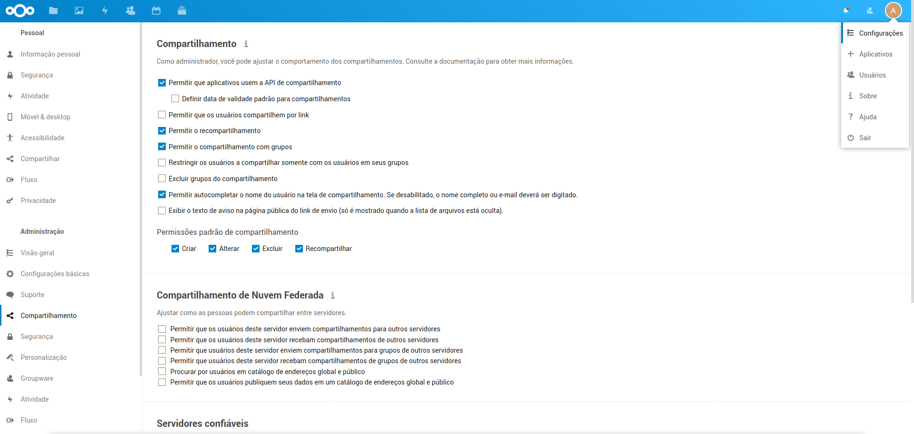
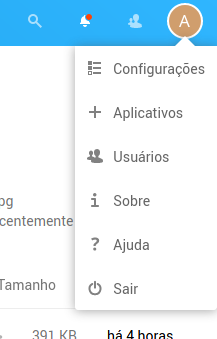
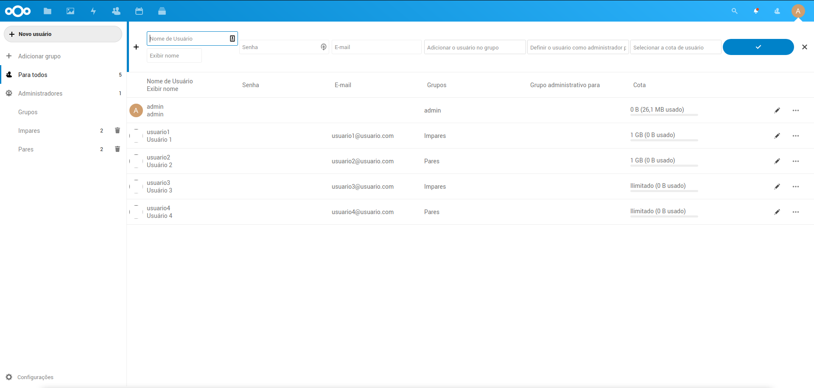
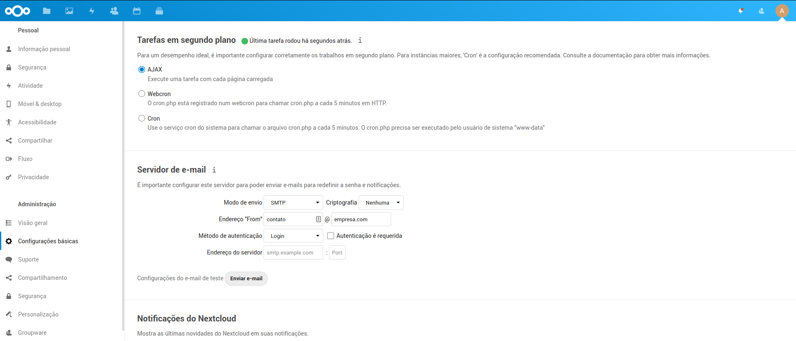

# Usuários, Grupos, compartilhamento e controle de acesso

Todo usuário do NextCloud possui uma quota, ou um espaço, de disco. Este espaço é definido pelo adminitrador do sistema, e será utilizado para armazenar os diferentes recursos que este usuário venha a criar/adicionar.

Todo recurso dentro do NextCloud, seja um arquivo, pasta, calendário, catálogo de endereços ou painel do Deck, é vinculado diretamente ao usuário que o criou/adicionou, o que significa que, para que outros usuários tenham acesso a um recurso, o usuario dono precisa primeiro habilitar o compartilhamento deste recurso.

É possivel compartilhar com um usuário específico ou com vários de uma vez, através dos grupos de usuário, cadastrados pelo administrador.

As ações que podem ser tomadas em um recurso compartilhado (exibição, modificação, remoção) são definidas somente pelo dono do recurso. Assim, para que seja possivel manter um controle do que pode ser acessado e por quem, recomenda-se que todos os recursos bases (pastas de arquivos, catálogo de endereços principal, painéis do Deck etc) sejam criados por um usuário administrador, para que este administrador possa definir quais grupos e usuários terão acesso ao recurso, e que nivel de acesso cada um terá.

O Administrador pode também configurar o comportamento geral de compartilhamento dos recursos. Estas configurações são definidas na sessão `Administração > Compartilhamento`, na página de `Configurações` do administrador.

Mesmo quando um recurso é compartilhado, ainda continua vinculado ao usuário dono. Isso significa que, mesmo que outros usuários editem, criem subrecursos (adicionar um item a uma pasta, por exemplo) ou compartilhem o recurso com outros usuários, o vinculo com o usuário dono permanece, sendo que qualquer alteração deo espaço em disco será contabilizada na quota do usuário dono.

## Adicionar Usuários, grupos e permissões básicas

Ao clicar no icone do usuário, no canto superior direito, o administrador pode adicionar novos usuários.

Neste painel é possivel visualizar todos os usuários cadastrados, e a que grupo cada um deles pertence/administra.

Ao cadastrar um novo usuário, é importante cadastrar uma senha, ou um email, para que, caso o usuário não tenha a senha, seja possivel para este usuário resetar através de um link que será enviado por email.

Para que seja possível enviar emails para os usuários, é necessário configurar os dados do servidor SMTP.
Isso deve ser feito nas configurações do administrador, nas configurações gerais.

Além de ser possivel cadastrar o usuário num grupo, também é possivel adicionar este usuário como administrador de um ou mais grupos, o que irá permitir que este usuário gerencie outros usuários destes grupos.

No caso dos administradores do sistema, sempre devem pertencer ao grupo `admin`.

Caso o grupo informado não exista ainda, um novo será criado, tendo o novo usuário como único integrante.
