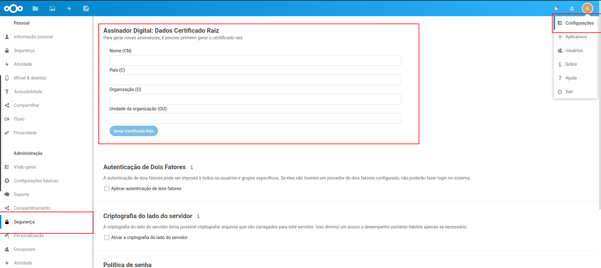

# Signer

Aplicativo NextCloud que permite assinar documentos PDF e gerar novas assinaturas de uso interno.

## Instalação

Para instalar o aplicativo, basta rodar na pasta raiz do projeto `make install-signer`.

## Configuração para Geração de Assinaturas

Para a geração de novos assinaturas de uso interno, é preciso primeiro configurar o certificado raiz.

Este certificado deve conter as informações da Entidade Certificadora Raiz que será responsável por todas as assinaturas geradas, e será por isso, será vinculado a todas as assinaturas geradas.

Para configurar, acesse o painel de configurações com um usuário administrador, e vá para a opção de "Segurança" na sessão "Administração".

**Importante:** no momento, não é possivel alterar as informações do certificado raiz.

## Geração de Assinaturas

Uma vez que o certificado raiz foi gerado pelo administrador do sistema, qualquer usuário pode gerar uma assinatura.

Para isso, basta acessar o icone "Signer" no topo da página, e informar os dados do formulário. Estes dados serão usados para compôr as ĩnformações do certificado, que irão ser adicionados aos arquivos assinados com a assinatura gerada.

A assinatura será salva no sistema de arquivos do NextCloud, conforme selecionado no formulário, e pode ser baixada clicando com o botão direito e selecionando a opção "Baixar".

## Assinatura de documentos

Ao abrir os detalhes de um arquivo PDF, haverá uma nova aba com o label `Assinar Documento`. Nesta aba, basta informar qual a assinatura a ser utilizada e a senha desta assinatura e clicar no botão de "Assinar Documento". Feito isso, será gerado um novo arquivo no mesmo local onde o arquivo original está, com o prefixo "signed_".

Os arquivos serão armazenados no sistema de arquivos do NextCloud, e podem ser baixados clicando com o botão direito e selecionando a opção "Baixar".
