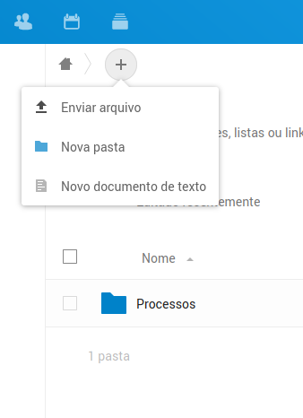
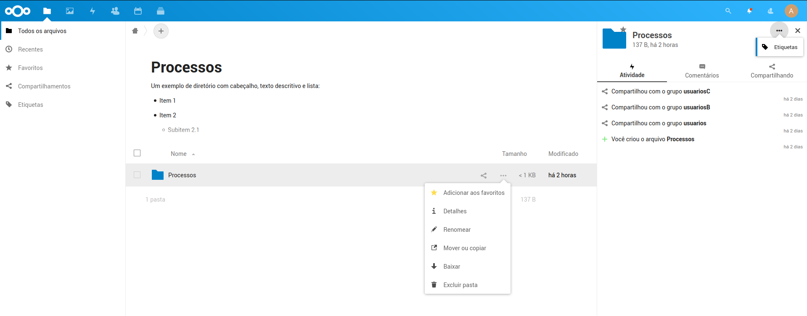

# Gestão de arquivos de processos

Cada usuário possui uma quota, ou espaço, de disco, definida pelo administrador do sistema, que pode ser usada para guardar qualquer tipo de arquivo, sendo possivel organizar estes arquivos em pastas e subpastas, conforme necessário.

## Adicionar arquivos

Para acessar a gestão os arquivos, basta acessar o icone de pasta no topo da aplicação. Por padrão, esta página é a página inicial do sistema.

Em todo diretório, é possivel adicionar um cabeçalho descritivo, clicando na parte superior a listagem de arquivos, onde esta a frase `Adicionar observações, listas ou links`.

Este cabeçalho será gravado num arquivo `Readme.md`, no diretório atual, e segue a formatação padrão Markdown, que permite títulos, imagens, listas e links, conforme formatação.

É possivel enviar arquivos de diferentes formatos e tamanhos, sendo possivel enviar vários arquivos de uma vez, utlizando o botão `+` na parte superior da tela, ou simplesmente arrastando e soltando os arquivos no navegador.

Também é possivel criar documentos de texto diretamente no NextCloud. Estes arquivos, assim como o cabeçalho, seguem a formatação padrão Markdown.

## Marcadores de estágio - Etiquetas

É possivel controlar os estágios dos processos pelo uso de etiquetas.

Qualquer pasta ou arquivo pode ter etiquetas, sejam colaborativas (criadas pelos usuários) ,restritas (criadas pelo administrador) ou invisiveis (criadas e visualizadas somente pelo administrador).

Para acessar ss etiquetas, abra o menu lateral de Detalhes da pasta/arquivo, que pode ser acessado clicando com o botão direito do mouse no item. Para adicionar uma etiqueta a pasta ou arquivo, selecione a opção `Etiquetas`.

As etiquetas restritas podem ser adicionadas aos arquivos somente pelo Administrador, mas serão visualizadas por todos que tem acesso ao arquivo.

Uma vez que as etiquetas sejam adicionadas as pastas dos processos, é possivel utilizar a busca por etiquetas no menu esquerdo para ter uma visualização de quais processos estão em cada estágio.

