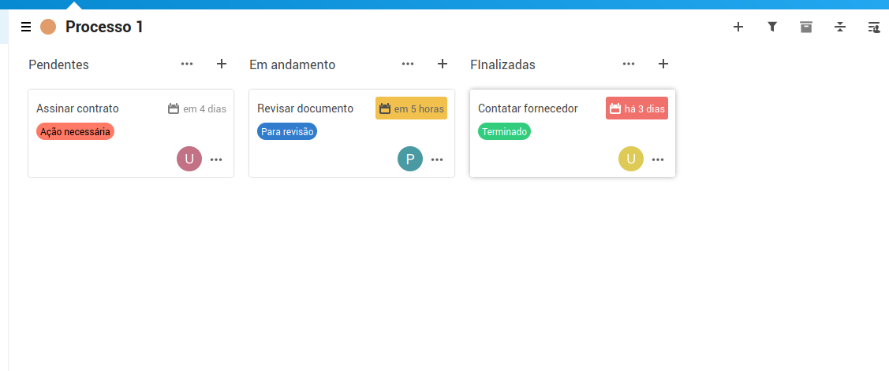

# Gestão de tarefas

É possivel gerenciar tarefas dos processos através dos painéis do Deck, criando listas (colunas) de acordo com o processo.

Também é possivel criar um painel para gerenciar os processos, criando um cartão para cada processo, e listas de acordo com os estágios do processo.

Para acessar o Deck, selecionar icone na barra superior.

Após criar um painel, é necessário criar as listas, que iram representar os estágios da tarefa, e então adicionar tarefas em uma das listas. As tarefas podem ser movidas de uma lista para a outra.

Além do título, também é possivel informar na tarefa uma data limite, descrição, atribuir a um usuário que tenha acesso ao painel.

Para adicionar estes detalhes a tarefa, basta clicar na tarefa e adicionar as informações no menu lateral a direita.

Para permitir que outros usuários vejam e movimentem as tarefas do painel, é necessário primeiro habilitar o compartilhamento, o que pode ser feito nos detalhes do painel.

Além do compartilhamento, nos detalhes do painel também é possivel editar as etiquetas usadas nas tarefas e verificar o que foi removido.

