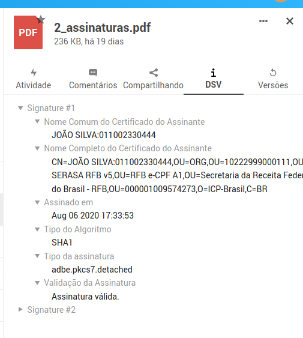

# DSV

Aplicativo NextCloud que exibe e valida assinaturas digitais em arquivos PDF

## Instalação

Para instalar o aplicativo, basta rodar na pasta raiz do projeto `make install-dsv`.

## Instalação e uso do app de validação de assinaturas

Ao abrir os detalhes de um arquivo PDF, haverá uma nova aba com o label `DSV`. Nesta aba será exibido os detalhes das assinaturas contidas neste PDF.

